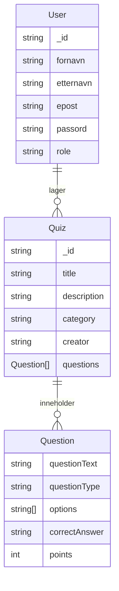

# IT Quiz Nettsted

Dette prosjektet er et webbasert quiz-system inspirert av Kahoot, laget for IT-faglige spørsmål. Løsningen lar brukere ta quizer, se resultater, og for administratorer å opprette, publisere og slette quizer.

## Prosjektmål
- Lage en brukervennlig plattform for å lage og ta IT-relaterte quizzer
- Støtte flere spørsmålstyper og sikre variasjon i quizutforming
- Implementere sikker innlogging for både brukere og administratorer
- Hoste løsningen på en virtuell maskin (VM)

## Funksjoner
- **Kahoot-lignende grensesnitt**: Svaralternativer vises i fargerike ruter (maks 2 per rad).
- **Quiztyper**: Støtte for flervalg, sant/usant og fritekst-spørsmål.
- **Resultatvisning**: Brukeren får se hvilke svar som var riktige/feil etter innlevering.
- **Poengsystem**: Hvert spørsmål gir poeng, og total poengsum vises etter quiz.
- **Admin-funksjoner**: Opprett, rediger, slett og publiser quizer. Brukerhåndtering.
- **Sikkerhet**: Riktige svar sendes aldri til frontend før quiz er levert.
- **Brukerautentisering**: Innlogging og registrering med JWT og sessions.

## Teknologi
- **Backend**: Node.js, Express, Mongoose (MongoDB)
- **Frontend**: EJS, Bootstrap, egen CSS for Kahoot-stil
- **Autentisering**: JWT, sessions, cookies

## ER-diagram (databasemodell)



- En **User** kan lage flere **Quiz** (én-til-mange)
- Hver **Quiz** har flere **Question** (innebygd i quiz-dokumentet)

## Mappestruktur

```
quiz-nettsted/
├── index.js
├── package.json
├── README.md
├── seedQuizzes.js
├── config/
│   └── database.js
├── controllers/
│   ├── adminController.js
│   ├── authController.js
│   ├── quizController.js
│   └── userController.js
├── middleware/
│   └── user.js
├── models/
│   ├── quizModel.js
│   └── userModel.js
├── public/
│   └── styles/
│       └── main.css
├── routes/
│   ├── adminRoute.js
│   ├── authRoute.js
│   ├── quizRoute.js
│   └── userRoute.js
├── utils/
│   ├── authUtil.js
│   ├── requireAdmin.js
│   ├── requireAuth.js
│   └── tokenBlacklist.js
└── views/
    ├── admin.ejs
    ├── create-quiz.ejs
    ├── faq.ejs
    ├── index.ejs
    ├── login.ejs
    ├── quiz-details.ejs
    ├── quiz-results.ejs
    ├── quizzes.ejs
    ├── register.ejs
    ├── take-quiz.ejs
    └── partials/
        ├── footer.ejs
        ├── header.ejs
        ├── messages.ejs
        └── navbar.ejs
```

## Kom i gang
1. Klon repoet og installer avhengigheter:
   ```
   git clone <repo-url>
   cd quiz-nettsted
   npm install
   ```
2. Sett opp `.env`-fil med følgende variabler:
   ```
   DATABASE_URL=<din-mongodb-url>
   SESSION_SECRET=<hemmelig-nøkkel>
   SECRET_KEY=<jwt-secret>
   PORT=3000
   ```
3. Kjør seed-script for å fylle databasen med eksempelquizer og adminbruker:
   ```
   node seedQuizzes.js
   ```
4. Start serveren:
   ```
   node index.js
   ```
5. Åpne nettleseren på `http://localhost:3000`

## Standard adminbruker
- E-post: `admin@admin.no`
- Passord: `Admin1234` (kan endres i seedQuizzes.js)

## Brukerveiledning
### For vanlige brukere
- Registrer deg med navn, e-post og passord
- Logg inn og ta tilgjengelige quizzer
- Se resultater og poengsum etter hver quiz
- Lag egne quizzer med ulike spørsmålstyper

### For administratorer
- Logg inn med admin-bruker
- Få tilgang til adminpanel for å se, redigere og slette quizzer og brukere
- Publiser eller skjul quizzer

## Hosting på VM
Nettsiden er hostet på en virtuell maskin (Ubuntu) med Node.js og MongoDB installert. Applikasjonen startes med `node index.js` og er tilgjengelig på VM-ens IP-adresse. Husk å åpne port 3000 i VM-brannmuren.

## Planleggingsdokumenter
- Se FAQ-siden (`/faq`) for prosjektspesifikke spørsmål og svar
- Prosjektplan, kravspesifikasjon og skisser kan legges ved som egne filer eller beskrives her

## Kontakt
Utviklet av Simon Tijanic

## Lisens
Dette prosjektet er kun for læringsformål.
